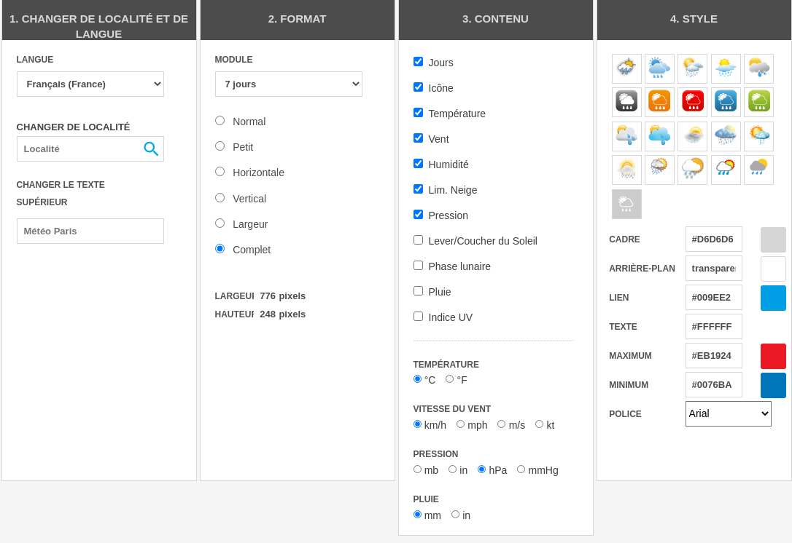
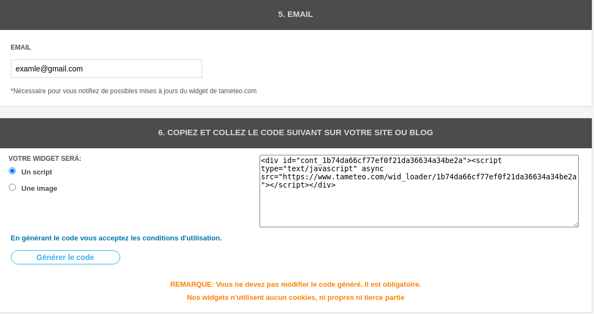

<p align="center" style="font-size=25px">
 Speed dial 
</p>


<p align="center">
    <a href="#projeto">Projeto</a> |
    <a href="#tecnologias">Tecnologias</a> |
    <a href="#como-usar">Como usar?</a> |
    <a href="#licença">Licença</a> |
    <a href="#como-customizar">Como customizar! </a>
</p>

<p align="center">
    
</p>

## Projeto

Speed Dial e um projeto de uma nova aba customizada para voce poder deixar seu navegador mais no seu estilo e facilitar um pouco sua vida. 

## Tecnologias

Este projeto foi desenvolvido com as seguintes tecnologias:

- HTML
- CSS
- JavaScript

## Como usar?

Como primeiro passo vamos baixar todo o repositorio com o sequinte comando.

```bash 
 git clone https://github.com/juangomes376/nova-aba
```
Para estar adicionado novos sites e facil como pode ver em baixo como no exemplo e so repetir com suas informacoes. 

### Exemplo (facebook)

```html
<a href="http://facebook.com" class="botoes">
    
    <p> facebook </p>
</a>
```
Voce podera repetir quantas tag A precisar para colocar todos os seus sites dentro da tag LI.

### grid exemplo

```html
 <div class="grid">
    <li>
        <a href="http://facebook.com" class="botoes">
            
            <p> facebook </p>
        </a>
    </li>
</div>
```
Para os titulos de cada box sao o sequinte codigo. 

```html
<div class="separacao">
    <p class="titulo">
        TITULO DO BOX 
    </p>
</div>
```

Para estar configurando a previsao do tempo utilizaremos o sequinte site. 

https://www.tameteo.com/widget/

Utilize as configuracoes de cor como no exemplo abaixo.

<p align="center">
    
</p>

Depois gere seu novo script de meteo. 
<p align="center">
    
</p>

Com seu novo script substituir sua nova div pela div que esta atualmente no codigo como no exemplo abaixo.

```html

<div id="cont_64683f84cfeda38ee7d4a20f20b4fc0d">
    <script type="text/javascript" async
        src="https://www.tempo.com/wid_loader/64683f84cfeda38ee7d4a20f20b4fc0d"></script>
</div>

```

## Como customizar!
 
No arquivo css voce podera estar fazendo todas as modificaçoes que voce precisar para deixar o projeto no seu stylo.

1- Plano de fundo 

Para trocar o plano de fundo total do projeto e so subtistuir  na tag body. 

2- Cor dos textos

Trocar o color da tag .color-text

3- plano de fundo dos conjuntos de botoes e titulos.

trocar o background-color na tag background


## Licença

Este projeto está sob licença do MIT. Veja o arquivo [LICENÇA](.github/LICENSE.md) para mais detalhes.
